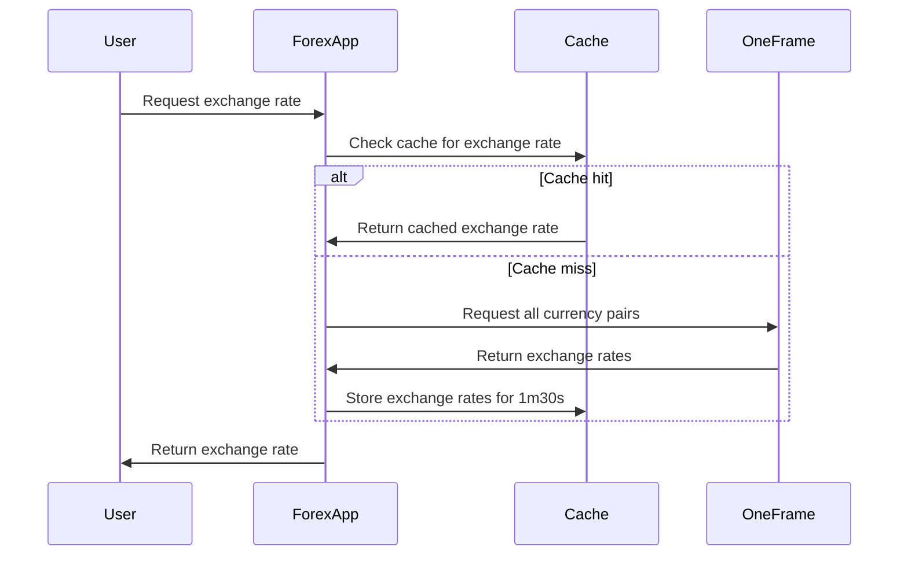

## Clarification of the problem
The requirements for the application to be implemented are as follows:

- Return exchange rate results
- The rate must return within 5 minutes
- Process at least 10,000 requests per day with a single API token

However, One-Frame, the exchange rate data source, has the following constraints:

- A maximum of 1,000 requests per day per authentication token is allowed.

Therefore, we must address the challenge of processing 10,000 requests while abiding by the 1,000 requests per token limitation of the external API, One-Frame.

## Solution
To solve this challenge, we have the following options:

- If the number of requests exceeds 1,000, request One-Frame to issue a new token.
- Restrict the requests to One-Frame to fit within the 1,000 request limit.

While the former option depends on external API costs, it could be better as it could cause unexpected loads on the external API if there is a temporary increase in access.

Let us perform a rough estimate to assess the latter option's feasibility. If we distribute 1,000 requests evenly throughout the day, we can issue approximately 0.7 requests per minute, as shown by the following formula:

```
1000req / 24h ≒ 41.7 req/h = (41.7 / 60) req/min ≒ 0.7 req/min
```

Conversely, the interval between each request would be about 1 minute and 30 seconds, as shown by the following formula:

```
24h / 1000req = 0.024 h/req = (0.024 * 60) min/req = 1.44 min/req
```

## Detail
Therefore, our goal is to achieve the following specifications:

- Accept requests from users in the Forex application.
- Retrieve exchange rates.
    - If a cache is hit, retrieve the result from the cache.
    - If no cache is hit, request One-Frame for all currency pairs from the Forex application and cache the results for 1 minute and 30 seconds.
- Return the most recent exchange rate obtained from the above processing for each request. Since we can get the exchange rate from a minute and a half ago at the latest, we can satisfy the requirement of "returning rates within 5 minutes."

The following diagram shows the sequence of events:


## Technical Compromises Made for this Project

 - Ideally, Redis would be used to store the cache, but due to time constraints for this technical challenge, only an in-memory cache will be used.
    - The cache will be stored in memory, so it will be lost when the application is restarted.
 - Similar to the One-Frame service, only one type of API token will be available, and an endpoint for issuing new tokens will not be supported.
 - Currencies will be limited in the listed currencies of `Currency.scala`