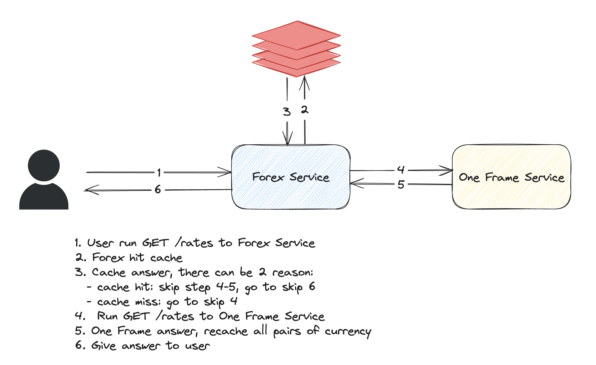

# Forex

Forex is a simple application that acts as a **local proxy** for getting exchange rates.
It's a service that can be consumed by other internal services to get the exchange rate between a set of currencies,
so they don't have to care about the specifics of third-party providers.

## API
The Forex service only provides a single endpoint:

**GET** `<host>:<port>/rates?from=<currency_id>&to=<currency_id>`

- `<host>` and `<port>`: The Forex service bind host and port, configured in `app.http.host` and `app.http.port` parameters.
- `<currency_id>`: One of the currently supported currency IDs: `AUD`, `CAD`, `CHF`, `EUR`, `GBP`, `NZD`, `JPY`, `SGD`, `USD`
###### Errors
* ```BadRequest(400)``` – incorrect request parameters.
* ```NotFound(404)``` – incorrect URL path or no data for requested currency pair.
* ```ServiceUnavailable(503)``` – processing took more time than configured in ```app.http.timeout``` parameter
  or One-Frame call failed.
* ```InternalServerError(500)``` – fatal error.

###### Example of request
```curl '127.0.0.1:8080/rates?from=AUD&to=CAD'```

###### Example of response

```
{
    "from": "AUD",
    "to": "CAD",
    "price": 0.4643238185719433735,
    "timestamp": "2023-10-07T10:25:25.576Z"
}
```

## Requirement

We need to implement the following use case:
- [x] The service returns an exchange rate when provided with 2 supported currencies
- [x] The rate should not be older than 5 minutes
- [x] The service should support at least 10,000 successful requests per day with 1 API token

Please note the following drawback of the **One-Frame service**:
- The One-Frame service supports a maximum of 1000 requests per day for any given authentication token.

## HOWTO

### How to Use

1. Run `One Frame API` and Redis: `docker-compose up`
2. Run Forex service: `sbt run`
3. Hit: http://localhost:9090/rates?from=USD&to=EUR

### How to test

## Architecture



The system will consist of:
- `Forex` service: main service that receive and response `/rates?from=<curr-1>&to=<curr-2>` request from user
- `One Frame` service: source of information for our `Forex Service`. The `Forex` service need `One Frame` by calling this endpoint: `/rates?pair=<pair-1>&pair=<pair-2>`
- `Redis`: cache to for faster lookup and solution to achieve 10,000request/day with only 

## Discussion

This section discussing how I derive the above architecture:

### Assumption
Let's start with the most restrictive assumption.
1. If we know `USD-JPY`, doesn't mean we can derive `JPY-USD = 1 / UDS-JPY`
2. If we know `USD-JPY` and `JPY-SGD`, doesn't mean we can derive `USD-SGD = USD-JPY * JPY-USD`


### Counting the Worst Scenario
We have these requirements:
- The service should support at least 10,000 successful requests per day with 1 API token (that can only serve 1000 request)
  - Forex should serve 10,000 requests a day
  - One Frame can only serve 1,000 request a day
- The rate should not be older than 5 minutes

At worst, if all of our request are **Cache Miss**:
- Given 9 currency, there are `9P2 = 9*8 = 72` pair.
- Every 5 minute, there are 72 pair of request.
- In 24 hour or 1440 minutes, there are 1440/5 = 288 intervals of 5 minutes.
- In total, we need to hit One Frame `72 * 288 = 20,736 request`

If we lift the first assumption:
- If we cache `USDJPY`, we can calculate `JPYUSD = 1/USDJPY`
- There's only `72/2=36` pairs
- In total, we need to hit One Frame `36 * 288 = 10,368 request`
still not work

We need to lift the 2nd assumption:
- Say we need to get `JPYSGD`
- We need to check in cache:
  - does `JPYSGD` exists
  - if not, does `a=JPY???` and `b=???SGD`, return `a*b`
  - if not, does `a=???JPY` and `b=SGD???`, return `1/a * 1/b`
- Given 9 currency, there are `9P2 = 9*8 = 72` pair
- There are `9-2=7` currencies left we can pair, so total of `72*7=504`
- For each 3 pair, say `JPY`, `???`, `SGD`, we need to exclude the duplicate by dividing them by `3!`
- There will be `504/6 = 84` requests at max in 5 minute interval or `84*288 = 24192`
- Actually, this is worse then previous solution and implementation will be really complicated.

### Final Solution
So, what's the right solution?
- Cache all possible /rates from One Frame Service into Redis.
  - Let say we only have 3 currency `USD`, `SGD`, `JPY`
  - Then, we will save 3P2=6 keys into Redis
  - (USDSGD -> Rate1, USDJPY -> Rate2, ... `JPYSGD` -> Rate6)

How it's works?
- When a user request to `Forex` service, we will:
  - Search in the Redis Cache first. If found the pair, return.
  - If not, do the caching process explained in above
  - Set the `expire` for each key as required, i.e. `5 minutes`
- This way we only need 288 request time at worst

## Test Design

- Test getting 1 pair given it's exists in cache
- Test getting 1 pair given it's exists it's not exist cache

## Layer of Application
1. domain: contains the domain logic of the application, including entities and value objects such as `Rate`, `Currency`
2. repo: provides access to storage such as database, `Redis` connection are in this layer
3. services: encapsulates application-specific logic and orchestrates interactions between different components
4. programs: consists of standalone executable programs or scripts that perform specific tasks
5. http: handles HTTP requests and responses, exposing endpoints for interaction with the application over the web
